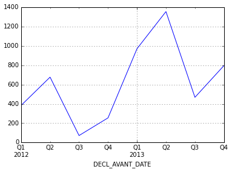
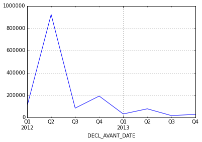
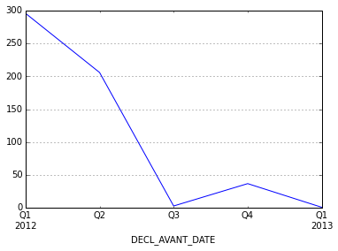
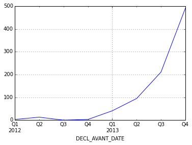
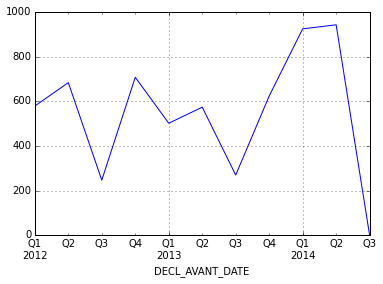
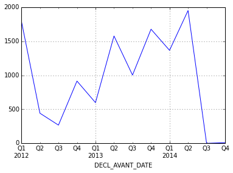
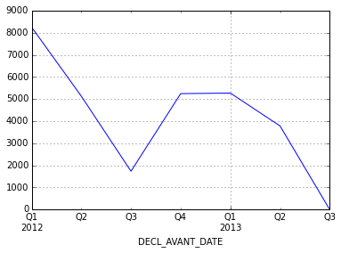
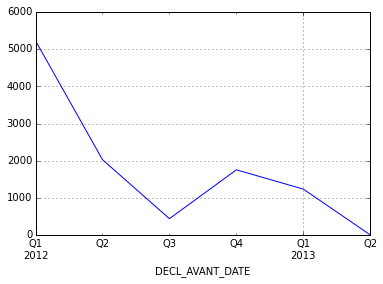
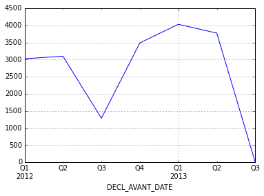
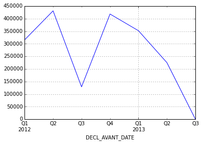

# Le scandale 3/4G : une influence sur la politique cadeaux des labos spécialisés ?

    # ces parties représentent le code utilisé pour réaliser l'exploitation ci dessous
    import sys
    import pandas as pd
    import numpy as np
    import json

## Exploitation des données de BAYER

    # Chargement des données
    labo = pd.read_csv("BAYER.anon.csv", encoding='utf-8')
    labo = labo[labo.DECL_AVANT_DATE != 'None']
    labo = labo.dropna(subset = ['DECL_AVANT_DATE'])
    labo = labo[labo.DECL_AVANT_DATE.str.contains(r'^20\d\d-')]
    avantages = labo[['DECL_AVANT_DATE','DECL_AVANT_MONTANT', 'BENEF_PS_QUALIFICATION', 'ORIGIN']]
    avantages.index = pd.to_datetime(avantages['DECL_AVANT_DATE'])

### Nombre des avantages en forte augmentation début 2013

    avantages['DECL_AVANT_MONTANT'].resample('BQ', how='count').plot()

### Les montants sont en revanche moins élevés que mi 2012

    avantages['DECL_AVANT_MONTANT'].resample('BQ', how='sum').plot()

En période de crise, il est logique que des contacts soient établis (et des
petits cadeaux comme des repas organisés) que des cadeaux à plusieurs milliers
d'euros comme en 2012)

### Les populations visées durant la période janvier 2013 à juillet 2013

    avantages[(avantages.index > '2013-01-01') & (avantages.index < '2013-07-01')].groupby(['ORIGIN', 'BENEF_PS_QUALIFICATION'])[['ORIGIN']].count().sort('ORIGIN', ascending=False)

<table border="1" class="dataframe">
  <thead>
    <tr style="text-align: right;">
      <th></th>
      <th></th>
      <th>ORIGIN</th>
    </tr>
    <tr>
      <th>ORIGIN</th>
      <th>BENEF_PS_QUALIFICATION</th>
      <th></th>
    </tr>
  </thead>
  <tbody>
    <tr>
      <th>Médecin</th>
      <th>Non renseigné</th>
      <td> 776</td>
    </tr>
    <tr>
      <th>Pharmacien</th>
      <th>Pharmacologie</th>
      <td> 614</td>
    </tr>
    <tr>
      <th rowspan="3" valign="top">Médecin</th>
      <th>Médecine générale</th>
      <td> 136</td>
    </tr>
    <tr>
      <th>Endocrinologie</th>
      <td>  94</td>
    </tr>
    <tr>
      <th>Pédiatrie</th>
      <td>  15</td>
    </tr>
    <tr>
      <th>Préparateur en pharmacie</th>
      <th>Préparation en pharmacie</th>
      <td>  14</td>
    </tr>
    <tr>
      <th>Pharmacien</th>
      <th>Préparation en pharmacie</th>
      <td>  10</td>
    </tr>
    <tr>
      <th rowspan="4" valign="top">Médecin</th>
      <th>Diabétologie</th>
      <td>   4</td>
    </tr>
    <tr>
      <th>Médecine interne</th>
      <td>   4</td>
    </tr>
    <tr>
      <th>Cardiologie</th>
      <td>   2</td>
    </tr>
    <tr>
      <th>Gynécologie</th>
      <td>   1</td>
    </tr>
  </tbody>
</table>

### Les gynécologues recoivent peu de cadeaux de BAYER pendant cette période

    avantages[avantages.BENEF_PS_QUALIFICATION == u'Gynécologie']['DECL_AVANT_MONTANT'].resample('BQ', how='count').plot()

### Les médecins généralistes plutot visés fin 2014

    avantages[avantages.BENEF_PS_QUALIFICATION == u'Médecine générale']['DECL_AVANT_MONTANT'].resample('BQ', how='count').plot()

## Données Effik

    # Chargement des données
    labo = pd.read_csv("EFFIK.anon.csv", encoding='utf-8')
    labo = labo[labo.DECL_AVANT_DATE != 'None']
    labo = labo.dropna(subset = ['DECL_AVANT_DATE'])
    labo = labo[labo.DECL_AVANT_DATE.str.contains(r'^20\d\d-')]
    avantages = labo[['DECL_AVANT_DATE','DECL_AVANT_MONTANT', 'BENEF_PS_QUALIFICATION', 'ORIGIN']]
    avantages.index = pd.to_datetime(avantages['DECL_AVANT_DATE'])

### Pas plus de cadeaux début 2013

    avantages['DECL_AVANT_MONTANT'].resample('BQ', how='count').plot()

### Mi 2013 : un transfert des cadeaux des gynécos vers les généralistes

    avantages[(avantages['BENEF_PS_QUALIFICATION'] == u'Gynécologie')|(avantages['BENEF_PS_QUALIFICATION'] == u'Médecine générale')].groupby(['ORIGIN', 'BENEF_PS_QUALIFICATION'])[['ORIGIN']].resample('BQ', how='count')

<table border="1" class="dataframe">
  <thead>
    <tr style="text-align: right;">
      <th></th>
      <th></th>
      <th></th>
      <th>ORIGIN</th>
    </tr>
    <tr>
      <th>ORIGIN</th>
      <th>BENEF_PS_QUALIFICATION</th>
      <th>DECL_AVANT_DATE</th>
      <th></th>
    </tr>
  </thead>
  <tbody>
    <tr>
      <th rowspan="18" valign="top">Médecin</th>
      <th rowspan="7" valign="top">Gynécologie</th>
      <th>2012-03-30</th>
      <td> 543</td>
    </tr>
    <tr>
      <th>2012-06-29</th>
      <td> 638</td>
    </tr>
    <tr>
      <th>2012-09-28</th>
      <td> 236</td>
    </tr>
    <tr>
      <th>2012-12-31</th>
      <td> 656</td>
    </tr>
    <tr>
      <th>2013-03-29</th>
      <td> 473</td>
    </tr>
    <tr>
      <th>2013-06-28</th>
      <td> 534</td>
    </tr>
    <tr>
      <th>2013-09-30</th>
      <td>   0</td>
    </tr>
    <tr>
      <th rowspan="11" valign="top">Médecine générale</th>
      <th>2012-03-30</th>
      <td>  29</td>
    </tr>
    <tr>
      <th>2012-06-29</th>
      <td>  40</td>
    </tr>
    <tr>
      <th>2012-09-28</th>
      <td>  10</td>
    </tr>
    <tr>
      <th>2012-12-31</th>
      <td>  44</td>
    </tr>
    <tr>
      <th>2013-03-29</th>
      <td>  27</td>
    </tr>
    <tr>
      <th>2013-06-28</th>
      <td>  37</td>
    </tr>
    <tr>
      <th>2013-09-30</th>
      <td> 263</td>
    </tr>
    <tr>
      <th>2013-12-31</th>
      <td> 597</td>
    </tr>
    <tr>
      <th>2014-03-31</th>
      <td> 910</td>
    </tr>
    <tr>
      <th>2014-06-30</th>
      <td> 917</td>
    </tr>
    <tr>
      <th>2014-09-30</th>
      <td>   0</td>
    </tr>
  </tbody>
</table>

Les dates correspondent à des semestres

## Exploitation des données Biogaram

    # Chargement des données
    labo = pd.read_csv("BIOGARAN.anon.csv", encoding='utf-8')
    labo = labo[labo.DECL_AVANT_DATE != 'None']
    labo = labo.dropna(subset = ['DECL_AVANT_DATE'])
    labo = labo[labo.DECL_AVANT_DATE.str.contains(r'^20\d\d-')]
    avantages = labo[['DECL_AVANT_DATE','DECL_AVANT_MONTANT', 'BENEF_PS_QUALIFICATION', 'ORIGIN']]
    avantages.index = pd.to_datetime(avantages['DECL_AVANT_DATE'])

### Pas particulièrement plus de cadaeux début 2013

    avantages['DECL_AVANT_MONTANT'].resample('BQ', how='count').plot()

### Des pharmaciens quasi exclusivement visés

    avantages.groupby(['ORIGIN', 'BENEF_PS_QUALIFICATION'])[['DECL_AVANT_MONTANT']].count()

<table border="1" class="dataframe">
  <thead>
    <tr style="text-align: right;">
      <th></th>
      <th></th>
      <th>DECL_AVANT_MONTANT</th>
    </tr>
    <tr>
      <th>ORIGIN</th>
      <th>BENEF_PS_QUALIFICATION</th>
      <th></th>
    </tr>
  </thead>
  <tbody>
    <tr>
      <th>Infirmier</th>
      <th>Infirmier</th>
      <td>   11</td>
    </tr>
    <tr>
      <th>Médecin</th>
      <th>Médecine générale</th>
      <td>   40</td>
    </tr>
    <tr>
      <th rowspan="3" valign="top">Pharmacien</th>
      <th>Angiologie</th>
      <td>    1</td>
    </tr>
    <tr>
      <th>Non renseigné</th>
      <td>   67</td>
    </tr>
    <tr>
      <th>Pharmacologie</th>
      <td> 9030</td>
    </tr>
    <tr>
      <th>Préparateur en pharmacie</th>
      <th>Préparation en pharmacie</th>
      <td> 2377</td>
    </tr>
  </tbody>
</table>

Sans doute du fait de son statut de génériqueur

## Analyse des données concernant les gynécos

    # Chargement des données
    gynecos = pd.read_csv("gynecos.anon.csv", encoding='utf-8')
    gynecos = gynecos[gynecos.BENEF_PS_QUALIFICATION == u'Gynécologie']
    gynecos = gynecos[gynecos.DECL_TYPE == 'AVANTAGE']
    gynecos = gynecos[gynecos.DECL_AVANT_DATE.str.contains(r'^20\d\d-')]
    gynecos.index = pd.to_datetime(gynecos['DECL_AVANT_DATE'])

### Nombre de cadeaux entre 2012 et 2014

    gynecos.LABO.count()

    29446

### Le nombre de cadeaux dans le temps

    gynecos['DECL_AVANT_MONTANT'].resample('BQ', how='count').plot()

### Le détails des investissements par labos

    gynecosParLabos = gynecos[['DECL_AVANT_MONTANT', 'LABO']].groupby('LABO').sum().sort('DECL_AVANT_MONTANT', ascending=False)
    gynecosParLabos['count'] = gynecos[['DECL_AVANT_MONTANT', 'LABO']].groupby('LABO').count()
    gynecosParLabos['moyenne'] = gynecosParLabos['DECL_AVANT_MONTANT']/gynecosParLabos['count']
    gynecosParLabos['porportion_count'] = gynecosParLabos['count'] * 100 / gynecos.LABO.count()
    gynecosParLabos['porportion_montant'] = gynecosParLabos['DECL_AVANT_MONTANT'] * 100 / gynecos.DECL_AVANT_MONTANT.sum()
    gynecosParLabos

<table border="1" class="dataframe">
  <thead>
    <tr style="text-align: right;">
      <th></th>
      <th>DECL_AVANT_MONTANT</th>
      <th>count</th>
      <th>moyenne</th>
      <th>porportion_count</th>
      <th>porportion_montant</th>
    </tr>
    <tr>
      <th>LABO</th>
      <th></th>
      <th></th>
      <th></th>
      <th></th>
      <th></th>
    </tr>
  </thead>
  <tbody>
    <tr>
      <th>Theramex SAM</th>
      <td> 915141.000000</td>
      <td> 10721</td>
      <td>  85.359668</td>
      <td> 36.409020</td>
      <td> 32.824239</td>
    </tr>
    <tr>
      <th>DAIICHI SANKYO</th>
      <td> 437192.000000</td>
      <td>  2818</td>
      <td> 155.142654</td>
      <td>  9.570060</td>
      <td> 15.681185</td>
    </tr>
    <tr>
      <th>BAYER</th>
      <td> 355986.000000</td>
      <td>   543</td>
      <td> 655.591160</td>
      <td>  1.844054</td>
      <td> 12.768491</td>
    </tr>
    <tr>
      <th>EFFIK</th>
      <td> 160580.000000</td>
      <td>  3080</td>
      <td>  52.136364</td>
      <td> 10.459825</td>
      <td>  5.759677</td>
    </tr>
    <tr>
      <th>GLAXOSMITHKLINE</th>
      <td> 145855.000000</td>
      <td>  1904</td>
      <td>  76.604517</td>
      <td>  6.466073</td>
      <td>  5.231521</td>
    </tr>
    <tr>
      <th>SERVIER</th>
      <td> 132258.000000</td>
      <td>  2655</td>
      <td>  49.814689</td>
      <td>  9.016505</td>
      <td>  4.743824</td>
    </tr>
    <tr>
      <th>IPSEN</th>
      <td> 128008.000000</td>
      <td>   993</td>
      <td> 128.910373</td>
      <td>  3.372275</td>
      <td>  4.591386</td>
    </tr>
    <tr>
      <th>NOVARTIS PHARMA</th>
      <td>  59278.000000</td>
      <td>   704</td>
      <td>  84.201705</td>
      <td>  2.390817</td>
      <td>  2.126181</td>
    </tr>
    <tr>
      <th>AMERICAN MEDICAL SYSTEMS</th>
      <td>  54406.000000</td>
      <td>   202</td>
      <td> 269.336634</td>
      <td>  0.686001</td>
      <td>  1.951432</td>
    </tr>
    <tr>
      <th>PFIZER</th>
      <td>  50629.000000</td>
      <td>   527</td>
      <td>  96.070209</td>
      <td>  1.789717</td>
      <td>  1.815959</td>
    </tr>
    <tr>
      <th>ROCHE</th>
      <td>  47956.000000</td>
      <td>   314</td>
      <td> 152.726115</td>
      <td>  1.066359</td>
      <td>  1.720084</td>
    </tr>
    <tr>
      <th>ASTELLAS PHARMA</th>
      <td>  37222.000000</td>
      <td>   296</td>
      <td> 125.750000</td>
      <td>  1.005230</td>
      <td>  1.335077</td>
    </tr>
    <tr>
      <th>COUSIN BIOSERV</th>
      <td>  34549.000000</td>
      <td>   226</td>
      <td> 152.871681</td>
      <td>  0.767507</td>
      <td>  1.239202</td>
    </tr>
    <tr>
      <th>SANOFI</th>
      <td>  31434.000000</td>
      <td>  1043</td>
      <td>  30.138063</td>
      <td>  3.542077</td>
      <td>  1.127473</td>
    </tr>
    <tr>
      <th>TAKEDA</th>
      <td>  21429.000000</td>
      <td>   757</td>
      <td>  28.307794</td>
      <td>  2.570808</td>
      <td>  0.768614</td>
    </tr>
    <tr>
      <th>BARD</th>
      <td>  20314.000000</td>
      <td>   147</td>
      <td> 138.190476</td>
      <td>  0.499219</td>
      <td>  0.728622</td>
    </tr>
    <tr>
      <th>AMGEN</th>
      <td>  19612.000000</td>
      <td>   171</td>
      <td> 114.690058</td>
      <td>  0.580724</td>
      <td>  0.703442</td>
    </tr>
    <tr>
      <th>SANOFI PASTEUR</th>
      <td>  16035.000000</td>
      <td>    29</td>
      <td> 552.931034</td>
      <td>  0.098485</td>
      <td>  0.575143</td>
    </tr>
    <tr>
      <th>GENEVRIER</th>
      <td>  15718.000000</td>
      <td>   498</td>
      <td>  31.562249</td>
      <td>  1.691231</td>
      <td>  0.563773</td>
    </tr>
    <tr>
      <th>COVIDIEN</th>
      <td>  12417.000000</td>
      <td>    85</td>
      <td> 146.082353</td>
      <td>  0.288664</td>
      <td>  0.445372</td>
    </tr>
    <tr>
      <th>PHARMATERA</th>
      <td>  11915.000000</td>
      <td>   452</td>
      <td>  26.360619</td>
      <td>  1.535013</td>
      <td>  0.427367</td>
    </tr>
    <tr>
      <th>CCD</th>
      <td>  10424.099998</td>
      <td>   215</td>
      <td>  48.484186</td>
      <td>  0.730150</td>
      <td>  0.373891</td>
    </tr>
    <tr>
      <th>GE Medical Systems</th>
      <td>   8685.000000</td>
      <td>   210</td>
      <td>  41.357143</td>
      <td>  0.713170</td>
      <td>  0.311513</td>
    </tr>
    <tr>
      <th>GEDEON RICHTER</th>
      <td>   7983.000000</td>
      <td>    48</td>
      <td> 166.312500</td>
      <td>  0.163010</td>
      <td>  0.286334</td>
    </tr>
    <tr>
      <th>BOEHRINGER INGELHEIM</th>
      <td>   5598.000000</td>
      <td>    72</td>
      <td>  77.750000</td>
      <td>  0.244515</td>
      <td>  0.200789</td>
    </tr>
    <tr>
      <th>Lilly</th>
      <td>   4860.000000</td>
      <td>    85</td>
      <td>  57.176471</td>
      <td>  0.288664</td>
      <td>  0.174318</td>
    </tr>
    <tr>
      <th>ALLERGAN</th>
      <td>   4782.000000</td>
      <td>    56</td>
      <td>  85.392857</td>
      <td>  0.190179</td>
      <td>  0.171521</td>
    </tr>
    <tr>
      <th>SANDOZ</th>
      <td>   3320.000000</td>
      <td>    10</td>
      <td> 332.000000</td>
      <td>  0.033960</td>
      <td>  0.119082</td>
    </tr>
    <tr>
      <th>Genzyme</th>
      <td>   2897.000000</td>
      <td>     8</td>
      <td> 362.125000</td>
      <td>  0.027168</td>
      <td>  0.103909</td>
    </tr>
    <tr>
      <th>NOVEX PHARMA</th>
      <td>   2822.000000</td>
      <td>    17</td>
      <td> 166.000000</td>
      <td>  0.057733</td>
      <td>  0.101219</td>
    </tr>
    <tr>
      <th>...</th>
      <td>...</td>
      <td>...</td>
      <td>...</td>
      <td>...</td>
      <td>...</td>
    </tr>
    <tr>
      <th>LABCATAL</th>
      <td>    754.000000</td>
      <td>    21</td>
      <td>  35.904762</td>
      <td>  0.071317</td>
      <td>  0.027044</td>
    </tr>
    <tr>
      <th>MEDTRONIC</th>
      <td>    644.000000</td>
      <td>    22</td>
      <td>  29.272727</td>
      <td>  0.074713</td>
      <td>  0.023099</td>
    </tr>
    <tr>
      <th>MEDA PHARMA</th>
      <td>    588.000000</td>
      <td>    12</td>
      <td>  49.000000</td>
      <td>  0.040753</td>
      <td>  0.021090</td>
    </tr>
    <tr>
      <th>Becton Dickinson</th>
      <td>    452.000000</td>
      <td>     3</td>
      <td> 150.666667</td>
      <td>  0.010188</td>
      <td>  0.016212</td>
    </tr>
    <tr>
      <th>ACTELION</th>
      <td>    423.000000</td>
      <td>     9</td>
      <td>  47.000000</td>
      <td>  0.030564</td>
      <td>  0.015172</td>
    </tr>
    <tr>
      <th>BRAHMS</th>
      <td>    374.720005</td>
      <td>    11</td>
      <td>  34.065455</td>
      <td>  0.037357</td>
      <td>  0.013440</td>
    </tr>
    <tr>
      <th>TEVA PHARMA</th>
      <td>    347.000000</td>
      <td>    13</td>
      <td>  26.692308</td>
      <td>  0.044149</td>
      <td>  0.012446</td>
    </tr>
    <tr>
      <th>LUNDBECK</th>
      <td>    289.000000</td>
      <td>     6</td>
      <td>  48.166667</td>
      <td>  0.020376</td>
      <td>  0.010366</td>
    </tr>
    <tr>
      <th>VIFOR</th>
      <td>    259.000000</td>
      <td>    15</td>
      <td>  17.266667</td>
      <td>  0.050941</td>
      <td>  0.009290</td>
    </tr>
    <tr>
      <th>CHUGAI PHARMA</th>
      <td>    246.000000</td>
      <td>    13</td>
      <td>  18.923077</td>
      <td>  0.044149</td>
      <td>  0.008824</td>
    </tr>
    <tr>
      <th>ST JUDE MEDICAL</th>
      <td>    212.000000</td>
      <td>     4</td>
      <td>  53.000000</td>
      <td>  0.013584</td>
      <td>  0.007604</td>
    </tr>
    <tr>
      <th>ZAMBON</th>
      <td>    206.000000</td>
      <td>     6</td>
      <td>  34.333333</td>
      <td>  0.020376</td>
      <td>  0.007389</td>
    </tr>
    <tr>
      <th>COVIDIEN IMAGING</th>
      <td>    196.870001</td>
      <td>     7</td>
      <td>  28.124286</td>
      <td>  0.023772</td>
      <td>  0.007061</td>
    </tr>
    <tr>
      <th>CONVATEC</th>
      <td>    183.000000</td>
      <td>     4</td>
      <td>  45.750000</td>
      <td>  0.013584</td>
      <td>  0.006564</td>
    </tr>
    <tr>
      <th>SMITHS MEDICAL</th>
      <td>    180.000000</td>
      <td>     1</td>
      <td> 180.000000</td>
      <td>  0.003396</td>
      <td>  0.006456</td>
    </tr>
    <tr>
      <th>ARCHIMEDES PHARMA</th>
      <td>    160.000000</td>
      <td>     7</td>
      <td>  22.857143</td>
      <td>  0.023772</td>
      <td>  0.005739</td>
    </tr>
    <tr>
      <th>ViiV HEALTHCARE</th>
      <td>    156.000000</td>
      <td>     3</td>
      <td>  52.000000</td>
      <td>  0.010188</td>
      <td>  0.005595</td>
    </tr>
    <tr>
      <th>PROSTRAKAN PHARMA</th>
      <td>    117.000000</td>
      <td>     5</td>
      <td>  23.400000</td>
      <td>  0.016980</td>
      <td>  0.004197</td>
    </tr>
    <tr>
      <th>EUSAPHARMA</th>
      <td>    115.980000</td>
      <td>     6</td>
      <td>  19.330000</td>
      <td>  0.020376</td>
      <td>  0.004160</td>
    </tr>
    <tr>
      <th>EXPANSCIENCE</th>
      <td>    105.000000</td>
      <td>     2</td>
      <td>  52.500000</td>
      <td>  0.006792</td>
      <td>  0.003766</td>
    </tr>
    <tr>
      <th>MEDLINE</th>
      <td>     75.000000</td>
      <td>     1</td>
      <td>  75.000000</td>
      <td>  0.003396</td>
      <td>  0.002690</td>
    </tr>
    <tr>
      <th>BIOCODEX</th>
      <td>     72.000000</td>
      <td>     1</td>
      <td>  72.000000</td>
      <td>  0.003396</td>
      <td>  0.002582</td>
    </tr>
    <tr>
      <th>BIOGEN IDEC</th>
      <td>     60.000000</td>
      <td>     1</td>
      <td>  60.000000</td>
      <td>  0.003396</td>
      <td>  0.002152</td>
    </tr>
    <tr>
      <th>COSMETIQUE ACTIVE</th>
      <td>     57.000000</td>
      <td>     1</td>
      <td>  57.000000</td>
      <td>  0.003396</td>
      <td>  0.002044</td>
    </tr>
    <tr>
      <th>CELGENE</th>
      <td>     54.000000</td>
      <td>     2</td>
      <td>  27.000000</td>
      <td>  0.006792</td>
      <td>  0.001937</td>
    </tr>
    <tr>
      <th>GALDERMA</th>
      <td>     50.000000</td>
      <td>     1</td>
      <td>  50.000000</td>
      <td>  0.003396</td>
      <td>  0.001793</td>
    </tr>
    <tr>
      <th>PHILIPS</th>
      <td>     34.000000</td>
      <td>     2</td>
      <td>  17.000000</td>
      <td>  0.006792</td>
      <td>  0.001220</td>
    </tr>
    <tr>
      <th>ORPHAN EUROPE</th>
      <td>     20.000000</td>
      <td>     1</td>
      <td>  20.000000</td>
      <td>  0.003396</td>
      <td>  0.000717</td>
    </tr>
    <tr>
      <th>INNOTECH INTERNATIONAL</th>
      <td>     19.000000</td>
      <td>     1</td>
      <td>  19.000000</td>
      <td>  0.003396</td>
      <td>  0.000681</td>
    </tr>
    <tr>
      <th>ALFA WASSERMANN PHARMA</th>
      <td>     10.000000</td>
      <td>     1</td>
      <td>  10.000000</td>
      <td>  0.003396</td>
      <td>  0.000359</td>
    </tr>
  </tbody>
</table>

76 rows × 5 columns

30% des cadeaux aux gynécos viennent d'un laboratoire : Theramex SAM

### Nombre de cadeaux : le pic de 2012 est lié à Theramex SAM

    #Theramex SAM
    gynecos[gynecos.LABO == 'Theramex SAM']['DECL_AVANT_MONTANT'].resample('BQ', how='count').plot()

### Au vu de ce biais, excluons Theramex SAM

    gynecos[gynecos.LABO != 'Theramex SAM']['DECL_AVANT_MONTANT'].resample('BQ', how='count').plot()

### Les montants investis (hors Theramax) montrent les même tendances

    gynecos[gynecos.LABO != 'Theramex SAM']['DECL_AVANT_MONTANT'].resample('BQ', how='sum').plot()

### Détail du nombre de cadeaux par labo et semestre

    semestres = gynecos.groupby(['LABO'])[['DECL_AVANT_MONTANT']].resample('BQ', how='count')
    semestres[semestres.DECL_AVANT_MONTANT > 100]

<table border="1" class="dataframe">
  <thead>
    <tr style="text-align: right;">
      <th></th>
      <th></th>
      <th>DECL_AVANT_MONTANT</th>
    </tr>
    <tr>
      <th>LABO</th>
      <th>DECL_AVANT_DATE</th>
      <th></th>
    </tr>
  </thead>
  <tbody>
    <tr>
      <th>AMERICAN MEDICAL SYSTEMS</th>
      <th>2013-03-29</th>
      <td>  118</td>
    </tr>
    <tr>
      <th rowspan="2" valign="top">ASTELLAS PHARMA</th>
      <th>2013-03-29</th>
      <td>  104</td>
    </tr>
    <tr>
      <th>2013-06-28</th>
      <td>  131</td>
    </tr>
    <tr>
      <th rowspan="2" valign="top">BAYER</th>
      <th>2012-03-30</th>
      <td>  296</td>
    </tr>
    <tr>
      <th>2012-06-29</th>
      <td>  206</td>
    </tr>
    <tr>
      <th>CCD</th>
      <th>2013-06-28</th>
      <td>  144</td>
    </tr>
    <tr>
      <th>COUSIN BIOSERV</th>
      <th>2013-03-29</th>
      <td>  141</td>
    </tr>
    <tr>
      <th rowspan="4" valign="top">DAIICHI SANKYO</th>
      <th>2012-03-30</th>
      <td>  975</td>
    </tr>
    <tr>
      <th>2012-06-29</th>
      <td>  425</td>
    </tr>
    <tr>
      <th>2012-09-28</th>
      <td>  210</td>
    </tr>
    <tr>
      <th>2012-12-31</th>
      <td> 1208</td>
    </tr>
    <tr>
      <th rowspan="6" valign="top">EFFIK</th>
      <th>2012-03-30</th>
      <td>  543</td>
    </tr>
    <tr>
      <th>2012-06-29</th>
      <td>  638</td>
    </tr>
    <tr>
      <th>2012-09-28</th>
      <td>  236</td>
    </tr>
    <tr>
      <th>2012-12-31</th>
      <td>  656</td>
    </tr>
    <tr>
      <th>2013-03-29</th>
      <td>  473</td>
    </tr>
    <tr>
      <th>2013-06-28</th>
      <td>  534</td>
    </tr>
    <tr>
      <th>GE Medical Systems</th>
      <th>2012-06-29</th>
      <td>  137</td>
    </tr>
    <tr>
      <th rowspan="2" valign="top">GENEVRIER</th>
      <th>2013-03-29</th>
      <td>  214</td>
    </tr>
    <tr>
      <th>2013-06-28</th>
      <td>  284</td>
    </tr>
    <tr>
      <th rowspan="2" valign="top">GLAXOSMITHKLINE</th>
      <th>2013-03-29</th>
      <td> 1045</td>
    </tr>
    <tr>
      <th>2013-06-28</th>
      <td>  855</td>
    </tr>
    <tr>
      <th rowspan="5" valign="top">IPSEN</th>
      <th>2012-03-30</th>
      <td>  185</td>
    </tr>
    <tr>
      <th>2012-06-29</th>
      <td>  231</td>
    </tr>
    <tr>
      <th>2012-09-28</th>
      <td>  141</td>
    </tr>
    <tr>
      <th>2012-12-31</th>
      <td>  130</td>
    </tr>
    <tr>
      <th>2013-06-28</th>
      <td>  216</td>
    </tr>
    <tr>
      <th rowspan="4" valign="top">NOVARTIS PHARMA</th>
      <th>2012-06-29</th>
      <td>  160</td>
    </tr>
    <tr>
      <th>2012-12-31</th>
      <td>  107</td>
    </tr>
    <tr>
      <th>2013-03-29</th>
      <td>  158</td>
    </tr>
    <tr>
      <th>2013-06-28</th>
      <td>  101</td>
    </tr>
    <tr>
      <th rowspan="4" valign="top">PFIZER</th>
      <th>2012-03-30</th>
      <td>  104</td>
    </tr>
    <tr>
      <th>2012-06-29</th>
      <td>  115</td>
    </tr>
    <tr>
      <th>2012-09-28</th>
      <td>  114</td>
    </tr>
    <tr>
      <th>2013-03-29</th>
      <td>  104</td>
    </tr>
    <tr>
      <th>PHARMATERA</th>
      <th>2013-06-28</th>
      <td>  189</td>
    </tr>
    <tr>
      <th>ROCHE</th>
      <th>2013-03-29</th>
      <td>  314</td>
    </tr>
    <tr>
      <th rowspan="4" valign="top">SANOFI</th>
      <th>2012-03-30</th>
      <td>  172</td>
    </tr>
    <tr>
      <th>2012-06-29</th>
      <td>  250</td>
    </tr>
    <tr>
      <th>2012-12-31</th>
      <td>  276</td>
    </tr>
    <tr>
      <th>2013-06-28</th>
      <td>  198</td>
    </tr>
    <tr>
      <th rowspan="6" valign="top">SERVIER</th>
      <th>2012-03-30</th>
      <td>  240</td>
    </tr>
    <tr>
      <th>2012-06-29</th>
      <td>  544</td>
    </tr>
    <tr>
      <th>2012-09-28</th>
      <td>  206</td>
    </tr>
    <tr>
      <th>2012-12-31</th>
      <td>  624</td>
    </tr>
    <tr>
      <th>2013-03-29</th>
      <td>  488</td>
    </tr>
    <tr>
      <th>2013-06-28</th>
      <td>  553</td>
    </tr>
    <tr>
      <th rowspan="4" valign="top">TAKEDA</th>
      <th>2012-03-30</th>
      <td>  192</td>
    </tr>
    <tr>
      <th>2012-06-29</th>
      <td>  169</td>
    </tr>
    <tr>
      <th>2012-12-31</th>
      <td>  155</td>
    </tr>
    <tr>
      <th>2013-03-29</th>
      <td>  141</td>
    </tr>
    <tr>
      <th rowspan="5" valign="top">Theramex SAM</th>
      <th>2012-03-30</th>
      <td> 5230</td>
    </tr>
    <tr>
      <th>2012-06-29</th>
      <td> 2033</td>
    </tr>
    <tr>
      <th>2012-09-28</th>
      <td>  447</td>
    </tr>
    <tr>
      <th>2012-12-31</th>
      <td> 1760</td>
    </tr>
    <tr>
      <th>2013-03-29</th>
      <td> 1241</td>
    </tr>
  </tbody>
</table>

    
